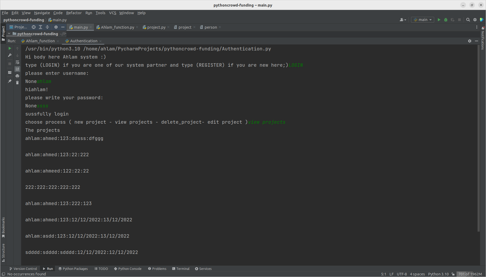
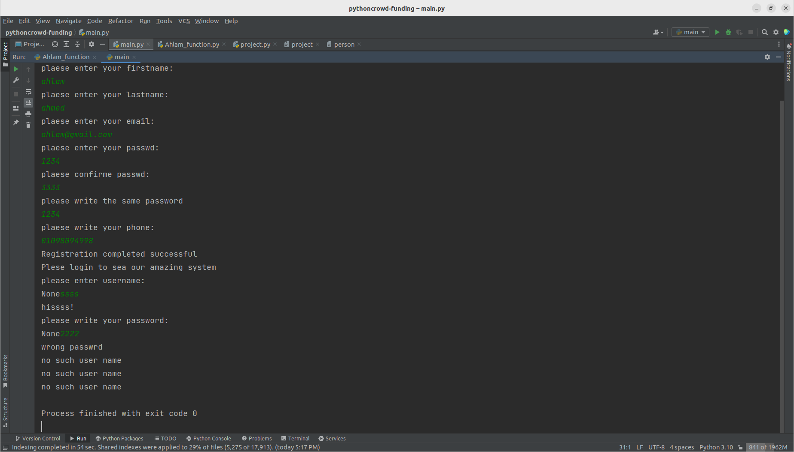
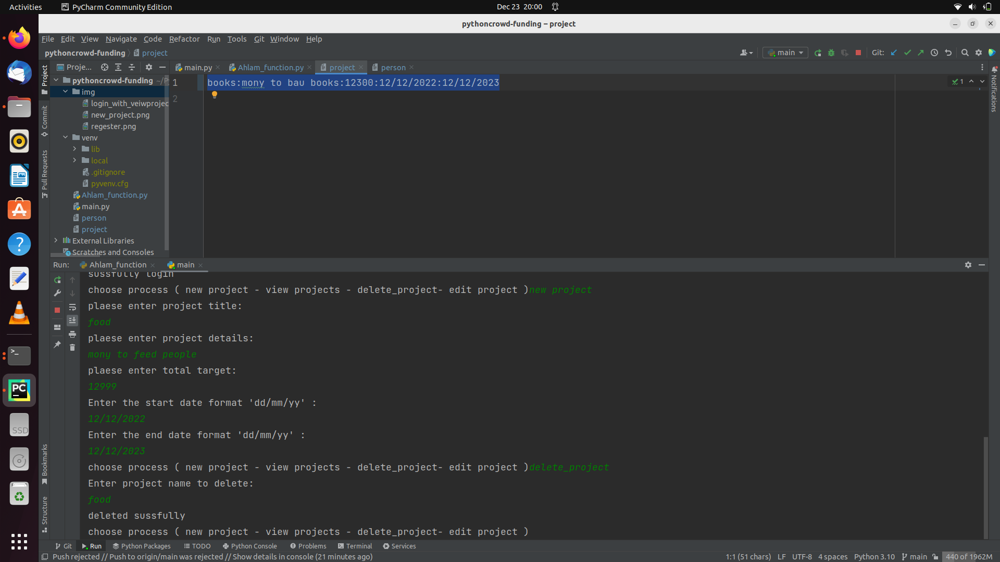
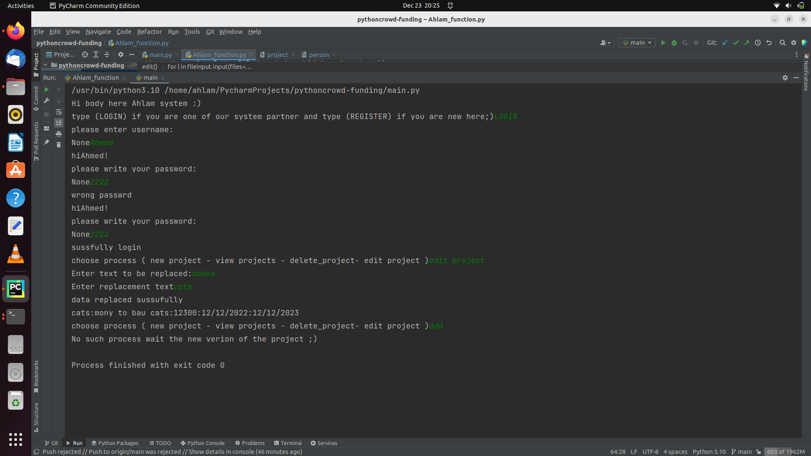
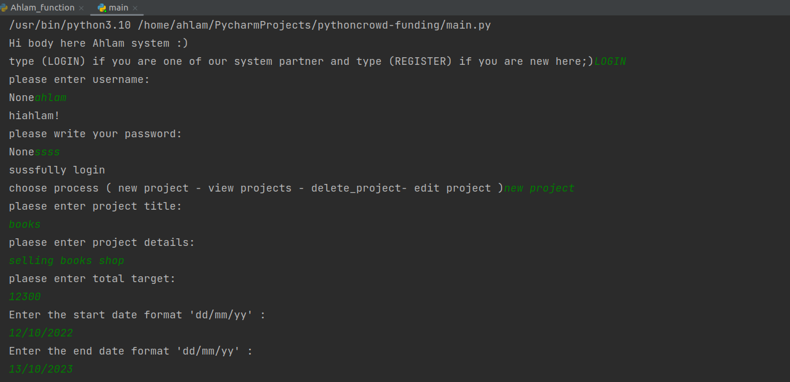

# Ahlam-Crowd-Funding-consoleapp
## you can run the project using main.py file  
## The project contains tow main functions  
## 1-login  
## 2-register  
once you regester you can enter the system to login in and use the functions  
functions that you can use  
## 1- vewi all projects  
## 2-edit your project  
## 3-delete specific project  
beside some add function to help and validate like:  
## 1- date validation  
## 2-phone number validation  
## 3-main menu to organize  
------------------------------------------------------------------------------------------------------------------------------------------------
screen

